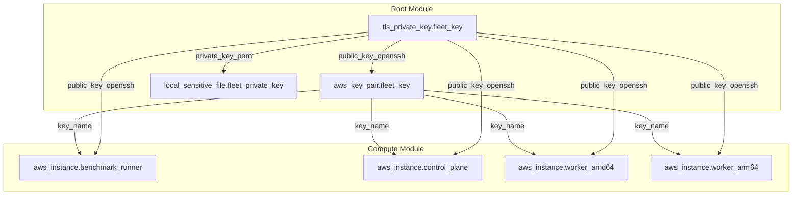

# Design Document: Dynamic SSH Key Management

## Overview

This design replaces the static `key_name` variable (which references a pre-existing EC2 key pair) with a fully OpenTofu-managed lifecycle for SSH key generation, registration, persistence, and fleet-wide injection. The implementation uses the `tls` provider to generate an ED25519 key pair at apply time, registers it with AWS EC2, writes the private key locally for operator access, and configures all fleet instances via cloud-init to enable SSH agent forwarding and trust the generated public key.

### Design Goals

1. **Zero manual prerequisites** — no pre-existing EC2 key pair required before `tofu apply`
2. **Per-run isolation** — each deployment gets a unique key pair scoped to its `run_id`
3. **Secure by default** — private key marked sensitive in state, written with 0600 permissions locally
4. **Fleet-wide consistency** — all instances (benchmark runner, control plane, workers) share the same key pair and cloud-init configuration
5. **Agent forwarding support** — enables SSH hopping between fleet hosts without distributing private keys

### Design Rationale

- **ED25519 over RSA**: Smaller keys, faster operations, stronger security at equivalent protection levels. The `tls_private_key` resource supports ED25519 natively.
- **Root module key generation**: The key pair is generated at the root module level (not inside the compute module) because it's a cross-cutting concern — the private key is written locally and the key pair name is passed to compute. This keeps the compute module focused on EC2 instance creation.
- **Cloud-init for SSH configuration**: Using `user_data` with a shell script is the standard approach for first-boot configuration on EC2 instances. It avoids needing configuration management tools (Ansible, etc.) for this simple task.

## Architecture



### Resource Dependency Chain

```
tls_private_key.fleet_key
├── aws_key_pair.fleet_key (depends on public key output)
│   └── module.compute (depends on key_name output)
│       ├── aws_instance.benchmark_runner (key_name + user_data)
│       ├── aws_instance.control_plane (key_name + user_data)
│       ├── aws_instance.worker_amd64 (key_name + user_data)
│       └── aws_instance.worker_arm64 (key_name + user_data)
└── local_sensitive_file.fleet_private_key (depends on private key output)
```

## Components and Interfaces

### Component 1: Key Generation (Root Module)

**File**: New file `ssh_key.tf` in the repository root

**Resources**:
- `tls_private_key.fleet_key` — generates the ED25519 key pair
- `aws_key_pair.fleet_key` — registers the public key with AWS EC2
- `local_sensitive_file.fleet_private_key` — writes the private key to disk

```hcl
# ssh_key.tf (root module)

resource "tls_private_key" "fleet_key" {
  algorithm = "ED25519"
}

resource "aws_key_pair" "fleet_key" {
  key_name   = "kasbench-${var.run_id}"
  public_key = tls_private_key.fleet_key.public_key_openssh
}

resource "local_sensitive_file" "fleet_private_key" {
  content         = tls_private_key.fleet_key.private_key_pem
  filename        = "${local.artifact_output_path}fleet_key.pem"
  file_permission = "0600"
}
```

### Component 2: Provider Declaration Update

**File**: `versions.tf` in the repository root

**Change**: Add the `tls` provider to `required_providers`:

```hcl
tls = {
  source  = "hashicorp/tls"
  version = "~> 4.0"
}
```

### Component 3: Compute Module Interface Changes

**File**: `modules/compute/variables.tf`

**Changes**:
- Replace the existing `key_name` variable (which has no validation) with a validated version
- Add new `fleet_public_key` variable for cloud-init injection

```hcl
variable "key_name" {
  description = "EC2 key pair name to assign to all fleet instances"
  type        = string

  validation {
    condition     = length(var.key_name) > 0
    error_message = "A non-empty key pair name is required."
  }
}

variable "fleet_public_key" {
  description = "SSH public key (OpenSSH format) to inject into all fleet instances via cloud-init"
  type        = string
}
```

### Component 4: Cloud-Init User Data (Compute Module)

**File**: New file `modules/compute/user_data.tf`

A `locals` block constructs the cloud-init script template that:
1. Appends the public key to the default user's `authorized_keys`
2. Enables SSH agent forwarding in `sshd_config`
3. Restarts the SSH daemon

```hcl
# modules/compute/user_data.tf

locals {
  cloud_init_script = <<-EOF
    #!/bin/bash
    set -euo pipefail

    # Inject fleet public key into authorized_keys for the default user
    AUTHORIZED_KEYS_FILE="/home/ubuntu/.ssh/authorized_keys"
    mkdir -p "$(dirname "$AUTHORIZED_KEYS_FILE")"
    echo "${var.fleet_public_key}" >> "$AUTHORIZED_KEYS_FILE"
    chmod 600 "$AUTHORIZED_KEYS_FILE"
    chown ubuntu:ubuntu "$AUTHORIZED_KEYS_FILE"

    # Enable SSH agent forwarding
    echo "AllowAgentForwarding yes" >> /etc/ssh/sshd_config

    # Restart SSH to apply changes
    systemctl restart ssh
  EOF
}
```

### Component 5: EC2 Instance Updates (Compute Module)

**Files**: `benchmark_runner.tf`, `control_plane.tf`, `workers.tf`

**Changes to each instance resource**:
- Add `user_data = local.cloud_init_script` attribute

The `key_name` attribute remains but will now receive the dynamically generated key pair name instead of the static variable value.

### Component 6: Root Module Wiring (main.tf)

**Changes to the compute module invocation**:
- Replace `key_name = var.key_name` with `key_name = aws_key_pair.fleet_key.key_name`
- Add `fleet_public_key = tls_private_key.fleet_key.public_key_openssh`

### Component 7: Root Module Outputs

**File**: `outputs.tf`

**New outputs**:
```hcl
output "ssh_private_key_path" {
  description = "Local file path to the generated SSH private key"
  value       = local_sensitive_file.fleet_private_key.filename
  sensitive   = true
}

output "ssh_key_pair_name" {
  description = "AWS EC2 key pair name assigned to all fleet instances"
  value       = aws_key_pair.fleet_key.key_name
}
```

### Component 8: Legacy Variable Removal

**Files affected**:
- `variables.tf` (root) — remove the `key_name` variable block
- `main.tf` (root) — remove `key_name = var.key_name` from compute module call
- `modules/compute/variables.tf` — update `key_name` variable with validation (keep the variable, change its contract)
- Any `.tfvars` files referencing `key_name` — remove the reference

## Data Models

### TLS Private Key Resource State

| Attribute | Type | Description |
|-----------|------|-------------|
| `algorithm` | string | Always "ED25519" |
| `private_key_pem` | string (sensitive) | PEM-encoded private key |
| `public_key_openssh` | string | OpenSSH-format public key (ssh-ed25519 ...) |
| `public_key_pem` | string | PEM-encoded public key |

### AWS Key Pair Resource State

| Attribute | Type | Description |
|-----------|------|-------------|
| `key_name` | string | `kasbench-<run_id>` |
| `public_key` | string | OpenSSH public key from tls_private_key |
| `fingerprint` | string | MD5 fingerprint of the key (AWS-computed) |

### Local Sensitive File Resource State

| Attribute | Type | Description |
|-----------|------|-------------|
| `filename` | string | `${artifact_output_path}fleet_key.pem` |
| `content` | string (sensitive) | PEM private key content |
| `file_permission` | string | "0600" |

### Cloud-Init Script Variables

| Variable | Source | Usage |
|----------|--------|-------|
| `fleet_public_key` | `tls_private_key.fleet_key.public_key_openssh` | Appended to authorized_keys |

## Error Handling

### Key Pair Name Conflict

If an `aws_key_pair` with name `kasbench-<run_id>` already exists in the target AWS account/region, the `aws_key_pair` resource will fail during `tofu apply` with an AWS API error (`InvalidKeyPair.Duplicate`). This is the expected behavior — each `run_id` must be unique.

**Mitigation**: The `run_id` variable is already required and unique per deployment. Operators must use distinct `run_id` values for concurrent deployments.

### Private Key File Write Failure

If the `local_sensitive_file` resource cannot write to the target path (permissions, disk full), `tofu apply` will fail with a filesystem error. The `local_sensitive_file` resource handles intermediate directory creation automatically via the `local` provider.

### Cloud-Init Failure

The cloud-init script uses `set -euo pipefail` so any command failure (including `systemctl restart ssh`) will cause the script to exit with a non-zero status. This is visible in:
- Instance system logs (`/var/log/cloud-init-output.log`)
- AWS Console → Instance → Actions → Monitor and troubleshoot → Get system log

**Impact**: If SSH restart fails, the instance will be running but SSH agent forwarding may not be active. The base SSH access via the registered key pair still works (EC2 injects the key pair independently of cloud-init).

### Compute Module Validation

The `key_name` variable validation (`length(var.key_name) > 0`) catches empty strings at plan time, preventing deployment of instances without a valid key pair reference.

## Correctness Properties

### Property 1: Key Pair Naming Uniqueness

**Validates: Requirements 2.3**

For any two concurrent deployments with distinct `run_id` values R1 and R2, the generated key pair names `kasbench-R1` and `kasbench-R2` SHALL be distinct strings, ensuring no naming collision in the AWS EC2 key pair namespace.

### Property 2: Fleet-Wide Key Consistency

**Validates: Requirements 4.1, 4.2, 6.4**

For every Fleet_Instance I in the set {benchmark_runner, control_plane, worker_amd64[0..N], worker_arm64[0..M]}, the `key_name` attribute of I SHALL equal the `key_name` output of the `aws_key_pair.fleet_key` resource, and the `user_data` of I SHALL contain the `public_key_openssh` output of `tls_private_key.fleet_key`.

### Property 3: Private Key File Permission Invariant

**Validates: Requirements 3.2**

After any successful `tofu apply`, the local file at `${artifact_output_path}fleet_key.pem` SHALL have Unix permissions exactly equal to octal 0600 (owner read+write only, no group or other access).

## Testing Strategy

### Why Property-Based Testing Does Not Apply

This feature is purely Infrastructure as Code (IaC) — it declares OpenTofu/Terraform resources (`tls_private_key`, `aws_key_pair`, `local_sensitive_file`, EC2 `user_data`). There are no pure functions, parsers, serializers, or business logic with meaningful input variation. The resources are declarative configurations, not functions with inputs/outputs that can be exercised across a wide input space.

### Recommended Testing Approach

#### 1. Static Validation (Pre-Apply)

- **`tofu validate`**: Confirms all resource references resolve, variable types match, and no syntax errors exist after the refactoring
- **`tofu plan`**: Verifies the expected resource creation/modification plan:
  - 1× `tls_private_key.fleet_key` (create)
  - 1× `aws_key_pair.fleet_key` (create)
  - 1× `local_sensitive_file.fleet_private_key` (create)
  - N× EC2 instances updated with `user_data` and new `key_name`
  - 0× references to the old `var.key_name`

#### 2. Integration Testing (Post-Apply)

- **Key pair existence**: Verify `aws ec2 describe-key-pairs --key-names kasbench-<run_id>` returns the registered key pair
- **Private key file**: Verify the file exists at the expected path with 0600 permissions and valid PEM content
- **SSH connectivity**: Verify SSH access to the benchmark runner using the generated private key
- **Agent forwarding**: Verify SSH agent forwarding works by hopping from benchmark runner to a worker node
- **Cloud-init completion**: Verify `/var/log/cloud-init-output.log` shows successful completion on fleet instances

#### 3. Destructive/Lifecycle Testing

- **Destroy and re-apply**: Confirm a new key pair is generated (different fingerprint) on fresh apply
- **Key pair name conflict**: Attempt to apply with a duplicate `run_id` and confirm the expected error

#### 4. Regression Testing

- **No `key_name` variable references**: `grep -r "key_name" *.tfvars` returns no matches
- **`tofu validate` passes**: No undefined variable errors after removal
