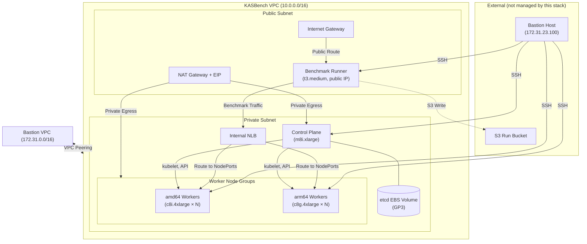

# KASBench Benchmark Infrastructure

OpenTofu infrastructure-as-code for provisioning the KASBench (Kubernetes Autoscaler Benchmark) AWS environment. This stack deploys a self-managed Kubernetes cluster on EC2 with heterogeneous worker nodes, an internal NLB for benchmark traffic routing, and full environment description generation for reproducibility.

## Architecture Overview



```
┌─────────────────────────────────────────────────────────────────────┐
│                      KASBench VPC (10.0.0.0/16)                     │
│                                                                     │
│  ┌─────────────────────────┐   ┌─────────────────────────────────┐  │
│  │    Public Subnet        │   │       Private Subnet            │  │
│  │                         │   │                                 │  │
│  │  ┌──────────────────┐   │   │  ┌────────────────────────────┐ │  │
│  │  │ Benchmark Runner │   │   │  │ Control Plane (amd64)      │ │  │
│  │  │ (t3.medium)      │───┼───┼─▶│ + etcd EBS volume          │ │  │
│  │  └──────────────────┘   │   │  └────────────────────────────┘ │  │
│  │                         │   │                                 │  │
│  │  ┌──────────────────┐   │   │  ┌────────────────────────────┐ │  │
│  │  │ NAT Gateway      │   │   │  │ Workers: amd64 group       │ │  │
│  │  └──────────────────┘   │   │  │ Workers: arm64 group       │ │  │
│  │                         │   │  └────────────────────────────┘ │  │
│  │  ┌──────────────────┐   │   │                                 │  │
│  │  │ Internet Gateway │   │   │  ┌────────────────────────────┐ │  │
│  │  └──────────────────┘   │   │  │ Internal NLB               │ │  │
│  │                         │   │  └────────────────────────────┘ │  │
│  └─────────────────────────┘   └─────────────────────────────────┘  │
└────────────────────────────────────┬────────────────────────────────┘
                                     │ VPC Peering
┌────────────────────────────────────┴────────────────────────────────┐
│                     Bastion VPC (172.31.0.0/16)                      │
│                                                                     │
│  ┌─────────────┐                                                    │
│  │ Bastion Host│  (externally managed, 172.31.23.100)               │
│  └─────────────┘                                                    │
└─────────────────────────────────────────────────────────────────────┘
```


## Prerequisites

- [OpenTofu](https://opentofu.org/docs/intro/install/) >= 1.6.0
- AWS credentials configured (via environment variables, `~/.aws/credentials`, or IAM role)
- A pre-existing **bastion host** with a known private IP (in a separate VPC)
- A pre-existing **S3 bucket** for benchmark run artifacts
- Custom **AMI IDs** for amd64 and arm64 instances (pre-built with Kubernetes toolchain)

## Repository Structure

```
.
├── main.tf                     # Root module — wires all child modules together
├── variables.tf                # All root-level input variables
├── outputs.tf                  # Outputs for Kubernetes bootstrap handoff
├── providers.tf                # AWS provider with default tags
├── versions.tf                 # OpenTofu and provider version constraints
├── environments/
│   ├── small.tfvars            # Small profile (dev/iteration)
│   └── benchmark.tfvars       # Full benchmark profile
├── modules/
│   ├── network/                # VPC, subnets, IGW, NAT GW, route tables, AZ selection, VPC peering
│   ├── security/               # Security groups and rules
│   ├── iam/                    # IAM roles, policies, instance profiles
│   ├── compute/                # EC2 instances (CP, workers, benchmark-runner)
│   ├── load-balancing/         # Internal NLB, listeners, target groups
│   ├── storage/                # Pre-created EBS volumes, StorageClass metadata
│   └── environment-description/ # JSON + Markdown report generation
└── artifacts/                  # Generated environment description output
```

## Environment Profiles

| Parameter | Small | Benchmark |
|-----------|-------|-----------|
| Control Plane | t3.large | m8i.xlarge |
| Workers per group | 1 | 5 |
| Worker types (amd64) | t3.large | c8i.4xlarge |
| Worker types (arm64) | t4g.large | c8g.4xlarge |
| Root volume | 50 GiB GP3 | 100 GiB GP3 |
| etcd volume | 20 GiB GP3 | 50 GiB GP3 |
| AZ selection | Explicit | Random |
| Total EC2 instances | 4 | 12 |

## Quick Start

### 1. Initialize

```bash
tofu init
```

### 2. Configure Variables

Copy and edit the appropriate tfvars file. You **must** replace all `PLACEHOLDER` values:

```bash
cp environments/small.tfvars environments/my-run.tfvars
```

Required replacements:

| Variable | Description |
|----------|-------------|
| `run_id` | Unique identifier for this benchmark run (e.g., `run-2026-05-28-001`) |
| `owner` | Your name or team for cost allocation tags |
| `bastion_ssh_cidr` | Private IP of your bastion host as a /32 CIDR (e.g., `"172.31.23.100/32"`) |
| `bastion_vpc_id` | VPC ID where the bastion host resides (for VPC peering) |
| `bastion_vpc_cidr` | CIDR block of the bastion VPC (for route table entries) |
| `run_bucket_name` | Name of the pre-existing S3 bucket for artifacts |
| `ami_amd64` | AMI ID for amd64 instances |
| `ami_arm64` | AMI ID for arm64 instances |

### 3. Plan

Preview what will be created:

```bash
# Small profile (development)
tofu plan -var-file=environments/small.tfvars

# Benchmark profile (full scale)
tofu plan -var-file=environments/benchmark.tfvars
```

### 4. Apply

Provision the infrastructure:

```bash
tofu apply -var-file=environments/small.tfvars
```

### 5. Retrieve Outputs

After apply, get the bootstrap handoff data:

```bash
# All outputs as JSON
tofu output -json

# Specific outputs
tofu output control_plane
tofu output worker_nodes
tofu output nlb
```

### 6. Destroy

Tear down all stack-managed resources:

```bash
tofu destroy -var-file=environments/small.tfvars
```

This destroys all resources created by the stack (VPC, EC2, EBS, NLB, IAM, security groups) but does **not** affect the bastion host, S3 bucket, or AMIs.

## Key Variables

### Required

| Variable | Type | Description |
|----------|------|-------------|
| `environment_profile` | `string` | `"small"` or `"benchmark"` |
| `availability_zone_mode` | `string` | `"explicit"` or `"random"` |
| `run_id` | `string` | Unique benchmark run identifier |
| `owner` | `string` | Owner for cost allocation |
| `bastion_ssh_cidr` | `string` | Bastion host private IP as /32 CIDR |
| `bastion_vpc_id` | `string` | Bastion VPC ID (for VPC peering) |
| `bastion_vpc_cidr` | `string` | Bastion VPC CIDR (for routing) |
| `run_bucket_name` | `string` | Pre-existing S3 bucket name |
| `ami_amd64` | `string` | AMI ID for amd64 instances |
| `ami_arm64` | `string` | AMI ID for arm64 instances |

### Optional

| Variable | Type | Default | Description |
|----------|------|---------|-------------|
| `availability_zone` | `string` | `null` | Explicit AZ (required when mode is `"explicit"`) |
| `debug_retention_enabled` | `bool` | `false` | Prevent destroy in small profile for debugging |
| `kubernetes_metadata` | `object` | `null` | K8s version, CNI, runtime metadata for reports |
| `observability_metadata` | `object` | `null` | Prometheus/Jaeger retention metadata |
| `autoscaler_metadata` | `object` | `null` | Autoscaler config metadata |
| `nlb_config` | `object` | HTTP on port 80→30080 | NLB listener/target group configuration |
| `trial_id` | `string` | `null` | Optional trial ID for tagging |

## Outputs

The stack exposes outputs designed for the separate Kubernetes bootstrap process:

- **`control_plane`** — Instance ID, private IP, type, AMI, architecture
- **`worker_nodes`** — Per-node metadata grouped by architecture
- **`benchmark_runner`** — Instance ID, public/private IPs
- **`nlb`** — DNS name, ARN, listener and target group details
- **`security_groups`** — All SG IDs with rule descriptions
- **`storage`** — EBS volume IDs and StorageClass metadata
- **`network`** — VPC ID, subnet IDs, AZ, gateway IDs
- **`environment_description_paths`** — Paths to generated JSON/Markdown reports
- **`provisioning_metadata`** — OpenTofu version, timestamp, git commit hash

## Environment Description

After `tofu apply`, the stack generates environment description files in `artifacts/<run_id>/`:

- **`environment-description.json`** — Machine-readable full infrastructure record
- **`environment-description.md`** — Human-readable Markdown report
- **`checksums.txt`** — SHA256 checksums of generated files

These files capture everything needed for the Full Disclosure Report: instance types, AMIs, network topology, security rules, IAM roles, storage config, and all metadata.

## Debug Retention Mode

For iterative development with the small profile, enable debug retention to prevent accidental `tofu destroy`:

```bash
tofu apply -var-file=environments/small.tfvars -var="debug_retention_enabled=true"
```

This adds lifecycle preconditions that block destruction of EC2 instances and EBS volumes. The benchmark profile always ignores this flag.

## Security Model

- All SSH access is restricted to the bastion host's private IP via CIDR-based security group rules
- VPC peering connects the bastion VPC to the KASBench VPC with routes in both directions
- The NLB is internal-only (no internet-facing endpoints)
- IAM roles follow least-privilege (scoped to specific resources/tags)
- Worker nodes get EBS CSI permissions for dynamic volume provisioning
- Benchmark runner gets S3 write access scoped to the specific run bucket

## Providers

| Provider | Source | Version |
|----------|--------|---------|
| AWS | `opentofu/aws` | `~> 5.0` |
| Random | `hashicorp/random` | `~> 3.6` |
| Local | `hashicorp/local` | `~> 2.5` |

## External Dependencies

This stack **does not manage** the following resources — they must exist before apply:

1. **Bastion Host** — EC2 instance in a separate VPC with a known private IP. This stack creates a VPC peering connection and bidirectional routes automatically.
2. **S3 Run Bucket** — Pre-created bucket for benchmark artifacts
3. **AMIs** — Custom machine images with Kubernetes toolchain pre-installed

## License

Apache License 2.0 — see [LICENSE](LICENSE) for details.
