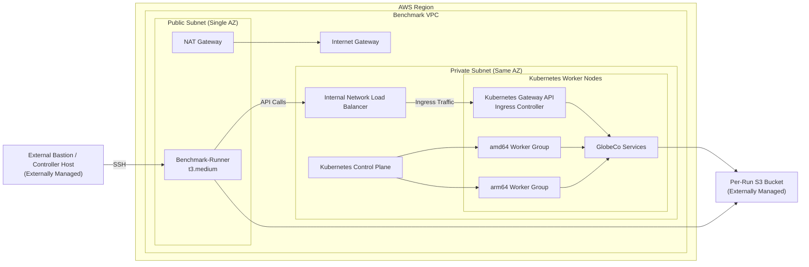

# KASBench AWS Infrastructure Requirements for OpenTofu

## 1. Purpose

This document defines requirements for implementing the KASBench AWS infrastructure as OpenTofu infrastructure-as-code. The infrastructure must support both:

1. **A full benchmark environment**, matching the dissertation's intended KASBench benchmark architecture.
2. **A small preliminary-test environment**, suitable for lower-cost development, smoke testing, and debugging.

The OpenTofu implementation must make it easy to switch between these environments without editing core module logic. The two environments should remain consistent in architecture and behavior; they should differ only in size, instance types, storage sizing, and other explicitly profile-sized capacity settings.

## 2. Source Architecture Summary

The solution architecture supports a self-managed, fixed-size Kubernetes cluster on AWS for evaluating Kubernetes autoscalers. The benchmark is coordinated from a separately provisioned bastion/controller host that runs the Benchmark Controller, Audit Tool, Reporting and Analysis Tool, and OpenTofu operations. A benchmark-runner EC2 instance created by this stack runs within the benchmark VPC and executes benchmark traffic generation and runtime operations against the cluster. Benchmark data is stored in a separately created S3 bucket, with one bucket per benchmark run, and is used to produce audit artifacts and a Full Disclosure Report (FDR).

The OpenTofu-managed architecture includes:

- One isolated VPC.
- One public subnet for the NAT Gateway and the benchmark-runner host.
- One private subnet for the Kubernetes cluster.
- One Internet Gateway.
- One NAT Gateway in both `small` and `benchmark` profiles.
- One internal Network Load Balancer (NLB) integrated with a Kubernetes Gateway API or ingress controller.
- One Kubernetes control-plane EC2 instance.
- Two worker-node groups: Intel/amd64 and ARM/Graviton/aarch64.
- References to a pre-existing S3 benchmark artifact bucket.
- EBS OS volumes and EBS-backed Kubernetes persistent volumes.
- Security groups for the benchmark-runner, NLB, control plane, and worker nodes.
- Rules permitting SSH access from the externally managed bastion/controller host to the benchmark-runner host.
- Rules permitting access from the benchmark-runner host to the internal NLB.
- IAM roles and instance profiles for nodes, S3 access, and the EBS CSI driver.

The following are explicitly **out of scope** for this OpenTofu stack:

- S3 benchmark bucket creation.
- Bastion/controller host creation.
- AMI/image creation.
- Kubernetes bootstrap and installation.
- Automatic environment destruction scheduling.
- AWS pricing metadata collection.


## 2.1 High-Level Infrastructure Diagram




## 3. Design Principles

### REQ-001: Configuration must be externalized

All environment-specific settings must be placed in one or more separate configuration files, not hard-coded in OpenTofu modules.

At minimum, the following must be configurable:

- AWS region.
- Availability Zone selection strategy.
- VPC CIDR block.
- Public and private subnet CIDR blocks.
- Instance types.
- Node counts.
- AMI IDs.
- Existing bastion/controller host identifiers.
- Existing bastion/controller security group ID.
- Existing benchmark S3 bucket name.
- Benchmark run ID.
- EBS volume sizes, types, throughput, and IOPS.
- Kubernetes version metadata, when known.
- Container runtime version metadata, when known.
- Helm version metadata, when known.
- CNI plugin metadata, when known.
- Tags.
- Environment profile name, such as `small` or `benchmark`.

### REQ-002: The same OpenTofu code must support multiple profiles

The implementation must support at least two profiles:

- `small`: a low-cost preliminary-test environment.
- `benchmark`: the full dissertation benchmark environment.

Switching profiles must require only a variable-file or workspace selection, for example:

```bash
tofu apply -var-file=environments/small.tfvars
tofu apply -var-file=environments/benchmark.tfvars
```

The core infrastructure modules must not be copied or manually edited to change profiles.

### REQ-003: Modules must be reusable and profile-neutral

The OpenTofu implementation should be organized into reusable modules, such as:

- `network`
- `security`
- `iam`
- `compute`
- `load-balancing`
- `storage`
- `environment-description`

Modules must accept input variables and must not assume a fixed benchmark size.

### REQ-004: Benchmark reproducibility must be prioritized

Infrastructure must be deterministic except where controlled randomization is required by the benchmark protocol.

The implementation must capture and output:

- Effective configuration values.
- Selected AWS region.
- Selected Availability Zone.
- Existing benchmark S3 bucket name.
- Existing bastion/controller host reference.
- Existing bastion/controller security group ID.
- Instance IDs.
- Instance types.
- AMI IDs.
- Volume IDs and specifications.
- Security group IDs and rules.
- Subnet IDs and CIDR blocks.
- Route table IDs and route rules.
- IAM role and instance profile names.
- Kubernetes node inventory.
- Timestamp of provisioning.
- OpenTofu version.
- AWS provider version.
- Git commit hash of the infrastructure repository, when available.

## 4. Environment Profiles

### 4.1 Full benchmark profile

The full benchmark profile must implement the dissertation's benchmark architecture.

| Category | Resource | Required full benchmark default |
|---|---|---|
| Network | VPC | 1 VPC, default `10.0.0.0/16` |
| Network | Subnets | 1 public subnet and 1 private subnet in a single AZ |
| Network | Internet Gateway | 1 |
| Network | NAT Gateway | 1, in the public subnet |
| Network | Internal NLB | 1 internal NLB integrated with a Kubernetes Gateway API or ingress controller |
| External input | Bastion/controller host | Pre-existing host created outside this stack; supplied as input |
| Compute | Control plane | 1 `m8i.xlarge` by default |
| Compute | Intel worker nodes | 5 `c8i.4xlarge` nodes by default |
| Compute | ARM worker nodes | 5 `c8g.4xlarge` nodes by default |
| Storage | S3 bucket | Pre-existing one-bucket-per-run artifact bucket supplied as input |
| Storage | OS EBS volumes | 100 GiB GP3 by default for each EC2 instance |
| Storage | Data EBS volumes | Dedicated GP3 volumes for stateful Kubernetes workloads |
| IAM/Security | Security groups | ALB, control plane, worker nodes; rules reference bastion/controller security group |
| IAM/Security | IAM roles | Node instance profiles for S3 access and EBS CSI support |

### 4.2 Small preliminary-test profile

The small profile must create a lower-cost environment for development and preliminary validation. It does not need to preserve full benchmark validity, but it must preserve the same topology and operational assumptions as the benchmark profile.

Recommended defaults:

| Category | Resource | Recommended small default |
|---|---|---|
| Network | VPC | 1 VPC, default `10.10.0.0/16` |
| Network | Subnets | 1 public subnet and 1 private subnet in a single AZ |
| Network | NAT Gateway | 1 NAT Gateway, same as benchmark profile |
| External input | Bastion/controller host | Pre-existing host created outside this stack; supplied as input |
| Compute | Control plane | 1 smaller general-purpose instance |
| Compute | Intel worker nodes | 1 configurable amd64 worker |
| Compute | ARM worker nodes | 1 configurable ARM worker |
| Storage | OS EBS volumes | Smaller configurable GP3 volumes, such as 40-60 GiB |
| Storage | Data EBS volumes | Smaller configurable GP3 volumes for test datasets |
| Observability | Prometheus/Jaeger | Supported by the Kubernetes bootstrap process, with reduced retention outside this stack |
| Benchmark validity | Status | Not valid for final benchmark results unless explicitly promoted to the benchmark profile |

The small profile must preserve the same topology pattern as the full profile where practical: externally managed bastion/controller host, private Kubernetes cluster, internal NLB, control plane, amd64 worker group, aarch64 worker group, pre-existing S3 artifact bucket, NAT Gateway, and EBS-backed persistent volumes.

## 5. AWS Network Requirements

### REQ-005: VPC

OpenTofu must create an isolated VPC.

The VPC CIDR block must be configurable. The benchmark default should be `10.0.0.0/16`.

### REQ-006: Subnets

OpenTofu must create:

- One public subnet for NAT Gateway placement and public routing.
- One private subnet for Kubernetes control-plane and worker nodes.

Both subnet CIDR blocks must be configurable.

The benchmark architecture uses a single Availability Zone. The selected AZ must be captured in outputs.

### REQ-007: Availability Zone selection

The implementation must support two AZ selection modes:

1. Explicit AZ supplied in configuration.
2. Random AZ selected from the configured region.

For benchmark runs, random selection within `us-east-1` should be supported. The selected AZ must be persisted in the OpenTofu state and included in outputs.

### REQ-008: Internet Gateway

OpenTofu must create and attach an Internet Gateway to the VPC.

The public subnet route table must route external traffic through the Internet Gateway.

### REQ-009: NAT Gateway

OpenTofu must create a NAT Gateway in the public subnet for private-node egress, including container image pulls, package downloads, and access to AWS APIs where VPC endpoints are not used.

The NAT Gateway must be enabled in both `small` and `benchmark` profiles to keep the environments consistent except for size and instance type.

### REQ-010: Routing

OpenTofu must create route tables and associations for:

- Public subnet egress through the Internet Gateway.
- Private subnet egress through the NAT Gateway.

Route table IDs and effective routes must be included in the environment description output.

## 6. Security Requirements

### REQ-011: Externally managed bastion/controller host input

The bastion/controller host is created outside this OpenTofu stack. The stack must require input variables sufficient to permit security-group configuration, including at least:

- Bastion/controller EC2 instance ID, when available.
- Bastion/controller private IP address or CIDR, when needed.
- Bastion/controller security group ID.
- Optional human-readable bastion/controller name.

The infrastructure stack must not create, replace, or destroy the bastion/controller host.

### REQ-012: ALB security group

The internal NLB security group must allow inbound benchmark traffic only from the externally managed bastion/controller host or its security group.

The ALB must not be internet-facing.

### REQ-013: Control-plane security group

The control-plane security group must allow only required Kubernetes control-plane, SSH, and node communication traffic.

Rules must be explicit and documented in outputs. Any SSH access must be limited to the externally managed bastion/controller host or its security group.

### REQ-014: Worker-node security group

The worker-node security group must allow required Kubernetes node-to-node, control-plane-to-node, NodePort, CNI, kubelet, and observability traffic.

Rules must be explicit and documented in outputs. Any SSH access must be limited to the externally managed bastion/controller host or its security group.

### REQ-015: Minimize external interference

The infrastructure must minimize exposure to external traffic so that probes, scans, and accidental external requests do not distort benchmark results.

The OpenTofu-managed Kubernetes infrastructure and ALB must not be externally reachable from the public Internet.

## 7. Compute Requirements

### REQ-016: Bastion/controller host is out of scope

OpenTofu must not create the bastion/controller host.

The externally managed bastion/controller host must be treated as an input dependency. The OpenTofu stack must configure security groups and outputs so the host can:

- Reach the internal NLB.
- SSH to the control-plane and worker nodes, if SSH is required for bootstrap or diagnostics.
- Access the pre-existing benchmark S3 bucket, subject to IAM policy configured outside or inside this stack as appropriate.
- Run the Benchmark Controller, Locust, Audit Tool, Reporting and Analysis Tool, and OpenTofu CLI outside the cluster.


### REQ-016A: Benchmark-runner host

OpenTofu must create one benchmark-runner EC2 instance in the public subnet of the benchmark VPC.

The benchmark-runner:

- Must reside in the same Availability Zone as the Kubernetes benchmark environment.
- Must be recreated for every benchmark environment deployment.
- Must be destroyed with the rest of the OpenTofu-managed benchmark infrastructure.
- Must use instance type `t3.medium` by default.
- Must be reachable only from the externally managed bastion/controller host via SSH through the Internet Gateway.
- Must not permit SSH or application access from any other source.
- Must be allowed to invoke APIs exposed through the internal NLB.
- Must function as the intermediary between the external bastion/controller host and the internal benchmark infrastructure.

The benchmark-runner may execute:

- Locust benchmark workloads.
- Validation and smoke-test operations.
- Benchmark orchestration helpers.
- Internal API calls to GlobeCo services through the NLB.
- Infrastructure validation scripts.

The benchmark-runner must not expose public application endpoints.


### REQ-017: Kubernetes control-plane node

OpenTofu must create one control-plane EC2 instance in the private subnet.

The instance type must be configurable. The benchmark default should be `m8i.xlarge`.

The control plane must be identifiable through tags and outputs so the separate Kubernetes bootstrap process can initialize it and taint it to prevent benchmark workloads from being scheduled on it.

### REQ-018: Worker-node groups

OpenTofu must create two configurable worker-node groups:

- Intel/amd64 worker group.
- ARM/Graviton/aarch64 worker group.

The benchmark defaults should be:

- 5 `c8i.4xlarge` Intel/amd64 workers.
- 5 `c8g.4xlarge` ARM/Graviton workers.

The small profile should be able to reduce each group to one node.

### REQ-019: Heterogeneous scheduling support

The infrastructure must tag and describe node architecture clearly so the separate Kubernetes bootstrap process can configure heterogeneous scheduling correctly.

The OpenTofu stack must not impose infrastructure-level restrictions that prevent GlobeCo pods from being scheduled on either architecture unless explicitly configured.

### REQ-020: Instance metadata

Instance metadata required for auditing must be captured, including:

- Instance ID.
- Instance type.
- Architecture.
- AMI ID.
- Private IP address.
- Public IP address, where applicable.
- Subnet ID.
- AZ.
- Security groups.
- Root volume ID.
- Launch time where obtainable.

## 8. AMI Requirements

### REQ-021: Custom AMIs supplied as inputs

AMI creation is a separate process and is out of scope for this OpenTofu stack.

The infrastructure must support custom AMIs for:

- amd64 instances.
- aarch64 instances.

The AMI IDs must be supplied through configuration.

The AMIs are expected to include, or be compatible with later installation of:

- The selected benchmark operating system.
- Git.
- containerd.
- Kubernetes components: `kubeadm`, `kubelet`, `kubectl`, and `kubernetes-cni`.
- Helm.
- Disabled swap.
- Enabled port forwarding.

### REQ-022: AMI immutability for benchmark runs

For benchmark runs, AMI IDs must be pinned.

OpenTofu must output the AMI IDs used in each run.

## 9. Kubernetes Bootstrap Boundary Requirements

### REQ-023: Self-managed Kubernetes support

The infrastructure must support self-managed Kubernetes rather than relying on EKS for the dissertation benchmark profile.

The design may later be adapted to managed Kubernetes, but the benchmark profile must create EC2-based self-managed control-plane and worker nodes.

### REQ-024: Kubernetes bootstrap is out of scope

Kubernetes bootstrap, cluster initialization, node joining, CNI installation, kube-proxy configuration, observability installation, autoscaler installation, and application deployment are handled separately from this OpenTofu stack.

The OpenTofu stack must provide all infrastructure inputs required by that separate bootstrap process, including:

- Control-plane instance ID and private IP.
- Worker instance IDs and private IPs.
- Node architecture mapping.
- Security group IDs.
- Internal ALB DNS name and target group details.
- EBS volume and storage configuration outputs.
- Existing S3 bucket name and run ID.

### REQ-025: Kubernetes metadata inputs and outputs

Where Kubernetes-level settings are known before provisioning, the OpenTofu configuration must accept them as metadata variables and include them in the environment description output. Examples include:

- Kubernetes version.
- CNI plugin and version.
- kube-proxy mode.
- Container runtime version.
- Helm version.
- Autoscaler under test.

These values are metadata for reporting and reproducibility; they do not imply that OpenTofu performs the Kubernetes bootstrap.

### REQ-026: Validation handoff

The OpenTofu stack must produce outputs that enable the separate bootstrap/validation process to confirm that:

- The control plane is reachable from the bastion/controller host.
- All worker nodes are reachable from the bastion/controller host.
- Node architectures are correctly provisioned.
- The internal NLB can reach the Kubernetes Gateway API or ingress controller after bootstrap.
- The bastion/controller host can reach the internal NLB.
- S3 artifact writes succeed to the pre-existing run bucket.

Validation results are produced outside OpenTofu but must be referenced or included in the final environment description when available.

## 10. Load Balancing Requirements

### REQ-027: Internal NLB

The benchmark environment shall not use an AWS Application Load Balancer (ALB).

Instead, OpenTofu must support one internal AWS Network Load Balancer (NLB).

The NLB shall:

- Exist only within the benchmark VPC.
- Not expose any public Internet-facing endpoints.
- Operate entirely within the benchmark environment's single Availability Zone architecture.
- Be reachable only from the benchmark-runner host.
- Serve as the infrastructure-layer load-balancing tier for benchmark traffic.

### REQ-028: Kubernetes Gateway API integration

The Kubernetes bootstrap process shall deploy a Kubernetes Gateway API implementation or ingress controller inside the cluster.

The benchmark environment shall use the following traffic flow:

External Bastion/Controller Host → Benchmark-Runner → Internal NLB → Kubernetes Gateway API / Ingress Controller → GlobeCo Services

The implementation shall:

- Use the Kubernetes Gateway API model or a compatible ingress-controller implementation.
- Expose the Gateway/ingress layer through an internal AWS NLB.
- Route benchmark traffic through the Gateway/ingress layer before reaching GlobeCo services.
- Restrict inbound NLB access to the benchmark-runner security group only.
- Prevent all direct public access to GlobeCo services.

The benchmark is not intended to evaluate advanced Layer-7 routing behavior, WAF behavior, or ingress autoscaling. The Gateway/ingress layer exists primarily to reflect realistic Kubernetes deployment architecture.

### REQ-029: Gateway/Ingress implementation flexibility

The implementation must support either:

1. Kubernetes Gateway API implementations, preferred.
2. Kubernetes ingress-controller implementations compatible with AWS NLB integration.

The exact implementation shall be configurable outside the OpenTofu modules.

Examples may include:

- Gateway API implementations.
- NGINX Ingress Controller.
- Traefik.
- HAProxy Ingress.

### REQ-030: Health checks

Load balancer and Gateway/ingress health checks must be configurable and documented in outputs.

### REQ-031: NLB configuration externalization

All NLB-related settings must be externally configurable, including:

- Listener ports.
- Gateway/ingress service ports.
- Health-check paths and ports.
- Protocol selection (TCP/TLS/HTTP/HTTPS).
- Allowed source CIDRs and security groups.
- Gateway implementation metadata.

These settings shall reside in environment configuration files rather than hardcoded infrastructure modules.

## 11. Storage Requirements

### REQ-030: OS EBS volumes

Every OpenTofu-managed EC2 instance must have a configurable root EBS volume.

The benchmark default should be 100 GiB GP3.

### REQ-031: Control-plane state storage

The control-plane node must use EBS storage suitable for etcd.

The configuration must allow provisioned IOPS and throughput to be set explicitly.

### REQ-032: Stateful workload EBS volumes

OpenTofu and/or later Kubernetes manifests must support dedicated GP3 EBS volumes for stateful Kubernetes services.

If OpenTofu creates EBS volumes directly, it must output all volume IDs, AZs, sizes, types, IOPS, throughput, attachment status, and intended workload mappings.

If Kubernetes dynamically provisions EBS volumes through the AWS EBS CSI driver, OpenTofu must supply IAM permissions and report the StorageClass assumptions as metadata.

### REQ-033: Data volume lifecycle

All block storage created by this OpenTofu stack must be destroyable through manual `tofu destroy`.

The implementation must not assume automated destruction. Manual destruction must remain safe and must not delete the externally created S3 run bucket.

## 12. S3 Artifact Storage Requirements

### REQ-034: Benchmark artifact bucket is external

The benchmark artifact bucket must be created outside this OpenTofu stack.

The KASBench operating model is one S3 bucket per benchmark run, with all run details stored in that bucket. Therefore, OpenTofu must reference an existing bucket name supplied as an input variable and must not create, replace, empty, or destroy the bucket.

### REQ-035: Artifact prefixes

Even though there is one bucket per run, each trial must write artifacts using a consistent prefix structure, such as:

```text
s3://<run_bucket>/trial-<trial_id>/
s3://<run_bucket>/environment/
s3://<run_bucket>/reports/
```

The exact prefix model must be configurable and included in outputs.

### REQ-036: Required S3 artifacts

The following artifact categories must be stored in the externally created S3 run bucket by the benchmark, bootstrap, audit, and reporting processes:

- OpenTofu outputs.
- Environment description JSON.
- Environment description Markdown.
- Kubernetes bootstrap logs.
- Kubernetes snapshots.
- Trial snapshots.
- Benchmark Controller logs.
- Locust SQLite databases.
- Prometheus query exports.
- Parquet metric exports.
- Kafka metric exports.
- PostgreSQL round-trip metric extracts.
- Jaeger traces or trace exports.
- Audit Tool outputs.
- Reporting and Analysis Tool outputs.
- Full Disclosure Report inputs.
- Checksums for all reproducibility artifacts.

### REQ-037: S3 security assumptions

The externally created S3 bucket must block public access and use encryption at rest.

Because bucket creation is out of scope, OpenTofu should not manage bucket-level settings unless explicitly configured to do so. If OpenTofu is granted read-only inspection permissions, it may report bucket public-access-block, encryption, versioning, and lifecycle settings in the environment description.

### REQ-038: S3 lifecycle is external

S3 lifecycle and retention policies are managed outside this OpenTofu stack.

OpenTofu must not configure lifecycle rules for the run bucket unless this is explicitly added to scope later.

## 13. IAM Requirements

### REQ-039: Least privilege

IAM policies must grant least-privilege access required by each role managed by this stack.

### REQ-040: Bastion/controller IAM boundary

The bastion/controller host is external. Its IAM role may also be managed outside this stack.

If this stack creates any IAM policy intended for attachment to the bastion/controller role, it must be optional, separately documented, and restricted to the supplied run bucket and infrastructure-read actions needed for environment description.

### REQ-041: Node role

Kubernetes node instance profiles must support:

- Required EC2 node operation.
- EBS CSI driver operations.
- Reading versioned container images if using AWS-hosted registries.
- Reading or writing permitted node-level logs or metadata only if required.
- Writing to the supplied S3 run bucket only if node-level artifact upload is required.

### REQ-042: EBS CSI support

IAM permissions required by the AWS EBS CSI driver must be included in the relevant node or service role.

## 14. Observability Support Requirements

### REQ-043: Observability installation is out of scope

Prometheus, Jaeger, cAdvisor, Metrics Server, OpenTelemetry Collector, VPA, KEDA, and application observability components are installed by the separate Kubernetes bootstrap/application deployment process.

OpenTofu must provide infrastructure support for these components, including security group rules, storage support, IAM permissions, and reportable metadata.

### REQ-044: Metric pipeline compatibility

The environment must support the five KASBench data collection pipelines:

1. cAdvisor container/pod metrics scraped by Prometheus and exported to Parquet.
2. GlobeCo asynchronous service custom metrics via OpenTelemetry Collector and Prometheus.
3. Locust request-level SQLite logging.
4. Kafka metrics via OpenTelemetry Collector and Prometheus.
5. PostgreSQL trade-service extracts for asynchronous throughput analysis.

### REQ-045: Metrics granularity support

The environment must support approximately 10-second metric collection granularity for cAdvisor, asynchronous-service metrics, and Kafka metrics.

### REQ-046: Observability retention metadata

Prometheus and Jaeger retention are configured outside this stack, but intended retention settings should be accepted as metadata variables and included in the environment description when known.

## 15. Benchmark Controller Integration Requirements

### REQ-047: Controller execution location

The Benchmark Controller must run from the externally managed bastion/controller host.

### REQ-048: Controller toolchain is out of scope

Installation of Python, Locust, Paramiko, Boto3, OpenTofu CLI, audit tooling, reporting tooling, and related dependencies on the bastion/controller host is out of scope for this OpenTofu stack.

### REQ-049: Infrastructure lifecycle

The Benchmark Controller or operator must be able to invoke OpenTofu to:

- Create the OpenTofu-managed infrastructure.
- Capture outputs.
- Pass outputs to the separate bootstrap process.
- Preserve outputs and environment-description files in the externally created run bucket.
- Destroy infrastructure manually when the operator chooses to do so.

Automatic destruction is not required at this stage.

### REQ-050: Trial independence

Each benchmark trial must be able to start from a newly created Kubernetes cluster with identical resource specifications.

The small profile may allow reuse for debugging, but benchmark-profile trials must support complete rebuild and teardown through manual OpenTofu operations.

## 16. Environment Description and FDR Output Requirements

### REQ-051: Complete environment description output

OpenTofu must output a complete machine-readable description of the provisioned environment suitable for inclusion in the KASBench Full Disclosure Report.

At minimum, the output must include:

- Run ID.
- Profile name.
- AWS account ID.
- Region.
- Availability Zone.
- VPC ID and CIDR.
- Public subnet ID and CIDR.
- Private subnet ID and CIDR.
- Internet Gateway ID.
- NAT Gateway ID.
- Route table IDs and routes.
- Load balancer DNS name, ARN, scheme, listeners, target groups, and health-check settings.
- Security group IDs and full ingress/egress rule descriptions.
- Externally managed bastion/controller host reference.
- Externally managed bastion/controller security group ID.
- IAM role names, policy names, and instance profile names.
- Control-plane instance description.
- Worker-node group descriptions.
- Per-node instance metadata.
- AMI IDs and architecture mappings.
- EBS volume descriptions.
- Existing S3 run bucket name and artifact prefix details.
- Kubernetes metadata values supplied to the stack.
- Intended observability and autoscaler metadata values supplied to the stack.
- OpenTofu version.
- AWS provider version.
- Git commit hash of the IaC repository, if available.
- Creation timestamp.
- Destroy timestamp, if manually captured after teardown.
- Validation result references, when produced by the external validation process.
- Checksums of generated configuration and output artifacts.

### REQ-052: Human-readable environment report

OpenTofu or a post-processing script must also generate a Markdown environment report suitable for direct inclusion or adaptation in the FDR.

Recommended output path:

```text
artifacts/<run_id>/environment-description.md
```

### REQ-053: JSON output

A JSON form of the environment description must be produced for audit tooling.

Recommended output path:

```text
artifacts/<run_id>/environment-description.json
```

### REQ-054: Output upload

The environment description files must be uploaded to the externally created S3 run bucket.

If upload is performed outside OpenTofu, OpenTofu must still produce local output files and enough metadata for the external upload process to place them correctly.

### REQ-055: No hidden effective settings

Any value that affects cost, scale, benchmark behavior, security exposure, or reproducibility must appear in the final environment output.

AWS pricing metadata is not required.

## 17. Tagging Requirements

### REQ-056: Required tags

All AWS resources that support tagging must include at least:

- `Project = KASBench`
- `EnvironmentProfile = small|benchmark|<other>`
- `RunId = <run_id>`
- `TrialId = <trial_id when applicable>`
- `ManagedBy = OpenTofu`
- `Owner = <configured owner>`
- `Purpose = KubernetesAutoscalingBenchmark`

### REQ-057: Cost allocation

Tags must support AWS cost allocation by benchmark run, trial, and profile.

Pricing metadata is not required in the environment-description outputs.

## 18. Teardown Requirements

### REQ-058: Manual teardown

The OpenTofu implementation must be able to destroy all infrastructure created by this stack through a manual `tofu destroy` operation.

The implementation must not destroy externally managed resources, including:

- The S3 run bucket.
- The bastion/controller host.
- AMIs created by the separate image-build process.
- Artifacts already written to S3.

### REQ-059: Artifact preservation before teardown

Before manual infrastructure destruction, the operator or external automation should verify that required logs, traces, metrics, environment descriptions, snapshots, and checksums have been uploaded to the externally created S3 run bucket.

The OpenTofu stack should expose outputs that make this verification easy.

### REQ-060: Debug retention mode

The small profile may support a configurable debug-retention mode that prevents accidental destruction of selected resources through lifecycle settings or operator workflow, such as:

- EC2 instances.
- EBS volumes.
- Kubernetes logs.

This mode must default to disabled for full benchmark runs.

## 19. Suggested Repository Layout

```text
infra/
  main.tf
  variables.tf
  outputs.tf
  providers.tf
  versions.tf

  modules/
    network/
    security/
    iam/
    compute/
    load-balancing/
    storage/
    environment-description/

  environments/
    small.tfvars
    benchmark.tfvars

  scripts/
    render_environment_description.py
    collect_versions.sh
    validate_infrastructure_outputs.sh

  artifacts/
    .gitkeep
```

## 20. Suggested Configuration Model

The implementation should use a profile variable such as:

```hcl
environment_profile = "small"
```

A profile variable file should define all profile-specific values. Example categories:

```hcl
aws_region              = "us-east-1"
availability_zone_mode  = "random"
availability_zone       = null

run_id                  = "kasbench-YYYYMMDD-HHMMSS"
run_bucket_name         = "kasbench-run-YYYYMMDD-HHMMSS"
artifact_prefixes = {
  environment = "environment/"
  reports     = "reports/"
  trials      = "trials/"
}

vpc_cidr                = "10.0.0.0/16"
public_subnet_cidr      = "10.0.1.0/24"
private_subnet_cidr     = "10.0.2.0/24"

bastion_instance_id        = "i-REPLACE_BASTION"
bastion_private_ip         = "10.0.1.10"
bastion_security_group_id  = "sg-REPLACE_BASTION"

control_plane = {
  instance_type = "m8i.xlarge"
  ami_id        = "ami-REPLACE_AMD64"
}

worker_groups = {
  amd64 = {
    instance_type = "c8i.4xlarge"
    count         = 5
    ami_id        = "ami-REPLACE_AMD64"
  }
  arm64 = {
    instance_type = "c8g.4xlarge"
    count         = 5
    ami_id        = "ami-REPLACE_ARM64"
  }
}

root_volume = {
  type       = "gp3"
  size_gib   = 100
  iops       = null
  throughput = null
}

nat_gateway_enabled     = true

kubernetes_metadata = {
  version          = "REPLACE"
  cni_plugin       = "flannel"
  cni_version      = "REPLACE"
  kube_proxy_mode  = "iptables"
  container_runtime = "containerd"
  helm_version     = "REPLACE"
}

autoscaler_metadata = {
  hpa_enabled  = true
  vpa_enabled  = false
  keda_enabled = false
}

debug_retention_enabled = false
```

## 21. Resolved Design Decisions

The following decisions are incorporated into these requirements:

1. Use **one S3 bucket per benchmark run**, with all run details stored in that bucket. Bucket creation is outside this OpenTofu stack.
2. Use a **NAT Gateway in both environments** so `small` and `benchmark` remain consistent except for size and instance types.
3. Treat **AMI creation as a separate process**. AMI IDs are inputs to this stack.
4. Treat the **bastion/controller host as a separate process**. The host and its security group are inputs to this stack.
5. Treat **Kubernetes bootstrap as a separate process**. This stack creates infrastructure and outputs the information needed by bootstrap tooling.
6. Do **not** include AWS pricing metadata in the environment-description output.
7. Perform **manual environment destruction** for now. The stack must support `tofu destroy`, but automatic teardown is not required.

## 22. Resolved Load-Balancing Decision

One technical implementation detail remains to be resolved before coding:

- AWS Application Load Balancers normally require subnets in at least two Availability Zones. The dissertation architecture describes a single-AZ benchmark environment. The implementation should either use an internal NLB, add a second load-balancer-only subnet in another AZ, or replace the ALB with another internal access pattern. The selected choice should be documented before the load-balancing module is implemented.
